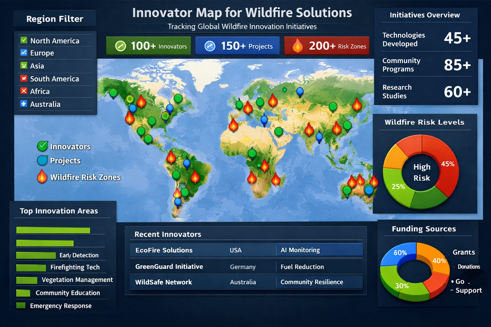
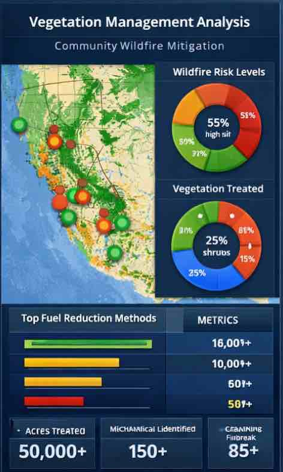
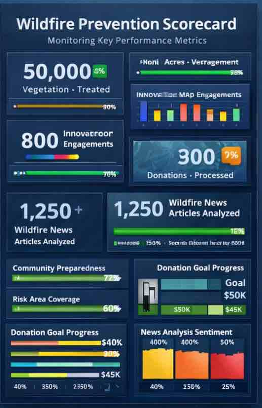
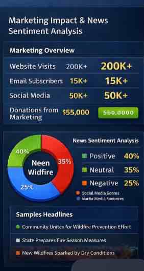

# Catastrophic Wildfire Prevention Consortium CWPC at CrowdDoing

  

**Organization:** Match4Foundation – CrowdDoing  
**Project:** Prevent Wildfire  
**Website:** https://preventwildfire.world/

---

## My Contributions

### 1. Innovator Map – Data Visualization
- Built interactive data visualizations for the Innovator Map.
- Displayed innovators, organizations, and wildfire-related initiatives geographically.
- Created dashboards to help users explore wildfire innovation efforts globally.
- Tools Used: Power BI / Tableau / Python (Pandas, Matplotlib, MapBox)

### 2. Chatbot for Donation Feature
- Developed a chatbot to assist users with donation-related queries.
- Automated responses and guided users through the donation process.
- Improved user engagement and simplified donation flow.
- Tools Used: Python, NLP, Dialogflow / OpenAI API

### 3. Vegetation Management Data Analysis – Community Wildfire Mitigation
- Analyzed vegetation and wildfire risk data to identify high-risk areas.
- Supported community wildfire mitigation planning using data insights.
- Performed data cleaning, analysis, and visualization.
- Tools Used: Python, Pandas, GIS Data, Data Visualization

### 4. Scorecard Data Analysis
- Performed data analysis for project scorecards and performance tracking.
- Created KPI dashboards and impact tracking reports.
- Helped stakeholders monitor progress and key metrics.
- Tools Used: Excel, SQL, Power BI

### 5. Sentiment Analysis for News Page
- Conducted sentiment analysis on wildfire-related news articles.
- Classified news sentiment as Positive, Negative, or Neutral.
- Helped understand public perception and awareness about wildfires.
- Tools Used: Python, NLP, TextBlob / VADER

## Tools & Technologies Used

### Programming & Data Analysis
- Python (Pandas, NumPy)
- SQL
- NLP (Natural Language Processing)
- Machine Learning

### Data Visualization & Dashboarding
- Power BI
- Tableau
- Data Visualization (Matplotlib, Seaborn)
- Mapbox (Geospatial Visualization)
- ESRI (GIS & Spatial Analysis)

### Backend & AI Development
- Chatbot Development
- Retrieval-Augmented Generation (RAG)
- API Development (Backend Integration)
- MongoDB (Database)

### Other Tools
- Excel
- Data Cleaning & Preprocessing
- Sentiment Analysis
- Geospatial Data Analysis

## Key Skills Demonstrated
- Data Analysis
- Data Visualization
- Dashboard Development
- Geospatial Analysis
- Machine Learning & NLP
- Chatbot Development
- Backend API Development
- Database Management
- Social Impact Data Projects

## Impact of My Work
- Improved wildfire awareness through data visualization.
- Automated donation assistance through chatbot development.
- Supported wildfire mitigation research using vegetation data analysis.
- Built dashboards for decision-making and impact tracking.
- Analyzed public sentiment on wildfire news.

## My Team

I work with a global team at the Catastrophic Wildfire Prevention Consortium (CWPC) at CrowdDoing, where data, technology, and social impact come together to build solutions for wildfire prevention and community resilience.

[Meet the Team – CWPC at CrowdDoing](https://preventwildfire.world/about)

---

## Author
**Venkata Sri Deepthi SriKotaPeetambaram**  
Data Analyst working on data, dashboards, maps, and AI for wildfire prevention.

⭐ If this project interests you, let’s connect, collaborate, or build something impactful together: 
[LinkedIn](https://www.linkedin.com/in/dvskp/)

---

## Closing Note
Where data meets purpose.  
Where technology meets impact.  
Where projects become solutions.

Thanks for exploring my work.

© 2026 Venkata Sri Deepthi SriKotaPeetambaram | Prevent Wildfire – Data & AI Project
